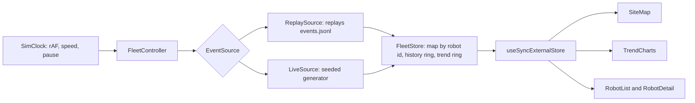

# Fleet Management Dashboard

Operator view of an eight robot fleet moving around a site. Driven either by the recorded
fifteen minute log or by a live feed that keeps generating new telemetry for the same
fleet. Both feed the same state and the same views.

| | |
| --- | --- |
| **Live** | https://gauravmasand.github.io/fleet-dashboard/ |
| **Assignment** | 1, frontend, plus the system design answers |
| **Stack** | React 19, TypeScript strict, Vite. No state library, no chart library, no UI kit |
| **Also read** | [`ANSWERS.md`](ANSWERS.md), [`SYSTEM_DESIGN.md`](SYSTEM_DESIGN.md) |

## Quick start

```bash
npm install
npm run dev          # http://localhost:5173
```

| Command | Does |
| --- | --- |
| `npm test` | 61 unit tests, vitest |
| `npm run typecheck` | tsc across app and tests |
| `npm run lint` | oxlint |
| `npm run build` | tsc -b and vite build, output in `dist/` |
| `npm run preview` | serve the production build |

Node 22 and npm. No services, no environment variables, no API keys. The three provided
files are unmodified under `public/data/` and are fetched at runtime.

## What the operator gets

| The brief asks for | How it is answered | Where |
| --- | --- | --- |
| Site and all eight robots, moving, legibly | `layout.png` inside an SVG whose viewBox is the image's own 900x560 space, so `x: 602.7, y: 344.8` lands exactly there with no scaling maths. Circles are pickers, rounded squares are haulers, fill is the status category, every marker is labelled | `components/SiteMap.tsx` |
| Faster than real time or a speed control | Both. 10x default, 1x to 50x, pause, and a scrubber over the recorded window | `components/TopBar.tsx`, `feed/clock.ts` |
| At least one fleet level trend, not a current value | Two. Share of the fleet per status category over time, and average battery against the weakest robot. Shared x axis and shared hovered sample | `components/TrendCharts.tsx` |
| Find a robot, or the ones needing attention | Search by id, type or status. Tiles double as filters. List ranked worst first. Detail panel gives the reason it is flagged, battery trace, time in status, distance, time since last report | `components/RobotList.tsx`, `RobotDetail.tsx` |

## Architecture



- Both sources implement one interface: `advanceTo(simTime)` returns every event up to that
  point. `FleetStore` cannot tell which one is running.
- Switching feeds swaps a single object. `LiveSource` is seeded from the robots currently on
  screen, so running the recording to 15:00 and flipping to Live carries positions,
  batteries and trend history straight across.
- State lives outside React. A burst of eight reports costs one render, not eight.

| File | Holds |
| --- | --- |
| `feed/source.ts` | The `EventSource` interface, the seam the whole design rests on |
| `state/fleetStore.ts` | Fleet state, bounded history and trend rings, snapshot building |
| `state/fleetController.ts` | Owns clock, current source and store. The only thing the UI talks to |
| `domain/status.ts` | The status taxonomy, thresholds and attention rules. One file, on purpose |
| `feed/liveSource.ts` | The generator |
| `data/parseEvents.ts` | Tolerant JSONL parsing |

## Decisions worth knowing about

| Decision | Why |
| --- | --- |
| Live feed generated in the browser | The spec allows it and asks for a browser fallback anyway. The deployed link is a static bundle with no backend that can be cold, rate limited or down |
| Trends sample state, not events | "What fraction was working at 7:30" is a fact about the fleet, not about how many packets arrived. Also carries last known state forward when a robot goes quiet, instead of leaving a hole |
| Seek rebuilds from t=0 | About a millisecond for 1448 events, so no snapshot cache to keep honest. Buys a testable invariant: seek to a time must equal playing to it |
| Taxonomy in one file | The brief leaves the definitions open and says be ready to defend them. Changing what counts as working is a two line edit |
| Offline robots stop reporting | What actually happens on a dropped connection. Gives the "no telemetry for 27s" path real silence to detect. One last report goes out first, the way an MQTT last will would |
| Per status counts stored raw in the trend | The categories can change later without invalidating history already collected |
| Dark theme only | It is a wall display. One theme that is properly contrast checked beats two that are not |

## Status taxonomy

The spec deliberately leaves this open. All of it lives in `src/domain/status.ts`.

| Category | Statuses | Reading |
| --- | --- | --- |
| Working | `active`, `on_mission` | Both move at about 2 units/s and drain 0.1%/s in the log, so they are the same thing operationally. `on_mission` is executing an assigned task, `active` is powered and moving without one |
| Idle | `idle` | Available, waiting for work |
| Charging | `charging` | Healthy but unavailable |
| Maintenance | `maintenance` | Planned downtime, not an alarm. Rendered hollow and colourless |
| Needs attention | `error`, `blocked`, `offline` | Plus two things no status reports: battery at or below 20% while not charging, and no telemetry for over 20 seconds |

Severity ranks the list: error 100, offline 90, silence 85, critical battery 80, blocked 60,
low battery 40.

## The live feed

- **Rate:** one report per robot per second at 1x, multiplied by the speed control like
  everything else.
- **Not invented.** Rates were measured off `events.jsonl`: movement 1.85 units/s active and
  2.1 on a mission, battery -0.1%/s moving, +0.41%/s charging, -0.01%/s parked, and a status
  transition table shaped like the one in the recording.
- **Respects the site.** Robots walk straight lines to waypoints sampled to be reachable
  without crossing the shelving traced from `layout.png` into `src/domain/site.ts`.
- **Deterministic.** Seeded PRNG, so the same seed gives the same feed and the tests can
  assert on it.

## Tests

61 tests, pure logic, no jsdom and no component tests. They cover the parts that were
actually hard.

| File | Pins |
| --- | --- |
| `state/fleetStore.test.ts` | Last writer wins by report time, late reports counted and dropped, unknown robots ignored, trend buckets rolling across a reporting gap, both rings bounded, staleness, snapshot identity, and **seek equals play** against the shipped log |
| `feed/liveSource.test.ts` | Same seed gives the same feed however the clock chunks it, positions stay on the floor and off the shelving over an hour of simulated time, battery in range, and the only gaps in a robot's stream follow an offline report |
| `state/fleetController.test.ts` | Playback through an injected frame scheduler, so the recording ending and the live feed taking over are tested without a browser |
| `parseEvents`, `geometry`, `status`, `charts`, `format` | Parser tolerance for bad lines, segment against rectangle intersection, attention rules, chart path maths |

## What I cut, and why

- **No component or end to end tests.** The logic tests carry the risk. UI was verified by
  driving the built bundle in headless Chrome: playback to the end, feed switch, search,
  tile filter, selection, console errors, at three viewport widths.
- **No URL state.** Cannot share a link to 7:30 with r3 selected. First thing I would add.
- **No task timeline.** The two `task_event` lines show as "last task event" and nothing
  more. The spec says nothing is graded on them.
- **History capped at 90 reports per robot.** The detail sparkline is a moving window. That
  cap is what stops a feed running all afternoon from growing without limit.
- **Generated robots pass through each other.** They respect the shelving, which is what
  makes the paths look right.
- **No light theme, list not virtualised.** Both fine at eight robots, both would need doing
  at five hundred.

## AI delegation notes

I used Claude Code as a coding assistant. The split was design and engineering on my side,
implementation on its side.

**Mine.** The whole thing turns on one question: how do a fixed recording and an open ended
generator drive the same views without the views knowing which is running. The answer is the
`EventSource` seam, and the rest follows from it:

- Fleet state outside React, published as an immutable snapshot.
- Trend sampling fleet state every 15 seconds instead of counting events.
- Seek rebuilding from t=0 rather than carrying snapshot checkpoints.
- Live feed in the browser so the deployed link has no backend to fall over.
- Status taxonomy and every threshold in one file.
- Offline robots going silent so the staleness path detects real silence.

**Delegated.** The implementation: components, CSS, the SVG path maths behind the charts,
test bodies and scaffolding. Also used to measure instead of guess, which is where the feed
rates, the obstacle rectangles and the scaling figures in `SYSTEM_DESIGN.md` come from.
Structuring this README was assisted too.

**Caught in review.** Switching to Live after the recording ended left the clock stopped, so
the feed sat there doing nothing; the fix is the `clock.start()` at the end of `setFeed`.
The battery chart drew a line climbing out of zero for the sample taken before any robot had
reported, which is why `TrendSample.reporting` exists.

## What I would do next

1. **URL state** for time, feed, selection and filter, so a shift handover is a link.
2. **A real transport behind `EventSource`:** a small server publishing the same
   `RobotEvent` shape over a WebSocket, browser generator kept as the offline fallback. The
   interface is already the seam for it.
3. **Canvas for the map above roughly a hundred robots.** That is where it starts dropping
   frames; numbers are in `SYSTEM_DESIGN.md`.
4. **Scope a trend to a subset of the fleet** instead of always all of it.
