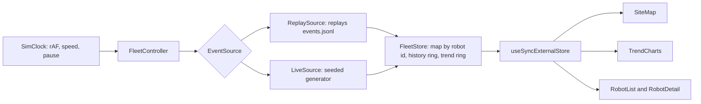

# System design answers

These are about the system in this repository: a React and TypeScript frontend where a clock
pulls events from an `EventSource` (either the recorded log or a generated live feed), a
`FleetStore` holds fleet state outside React, and components read an immutable snapshot
through `useSyncExternalStore`.

*Diagram produced with the help of an AI assistant.*

---

## 1. Adding a new feature later

**The short answer:** the design has one seam that matters, `EventSource` in
`src/feed/source.ts`. A source is anything with `advanceTo(simTime) -> RobotEvent[]`, and
`FleetStore` cannot tell which one is running. Nothing else is coupled to where data
comes from.

**Worked example: show which robots are behind on their assigned tasks, and trend task
throughput over the window.** It plugs in without a rework:

| Step | Where | Change |
| --- | --- | --- |
| Carry the new fields | `src/data/parseEvents.ts`, `src/domain/types.ts` | The parser already tolerates unknown keys and only keeps `task_event` when it recognises the value. `task_id` and `task_deadline` go in the same validation block |
| Track the open task | `FleetStore.applyToRecord` | Already records `lastTask` per robot. It would keep an open task instead, and `RobotState` gains `currentTask` |
| Add the trend series | `FleetStore.sampleFleet`, `src/components/TrendCharts.tsx` | One line to add `tasksCompleted` to `TrendSample`, one series in the chart, which already takes an array of columns and returns one path per series |
| Add the alert | `attentionReasons` in `src/domain/status.ts` | "Behind on its task" is one new entry with a severity number |

**Why the trend part does not hurt:** `sampleFleet` stores raw per status counts rather than
derived categories, precisely so the taxonomy can change without invalidating history
already collected.

**Why the alert part does not hurt:** the list ordering, the tile count, the map halo and the
detail panel all read from `attentionReasons`. Adding a rule lights all four up without
touching any of them.

**What would need a rework:** anything historical beyond the current session, such as "what
did the fleet do last Tuesday".

- Both rings in `FleetStore` are bounded on purpose and nothing is persisted.
- That is a backend and a query API, not a change to this code.
- The right shape would be for the dashboard to fetch a time range into a second, read only
  store rather than making the live one unbounded.

---

## 2. Growing from eight robots to five hundred

**The short answer: the map breaks first, and well before the state layer does.** I measured
both rather than guessing.

**State layer,** measured in node with a synthetic roster. One full round of reports plus a
snapshot rebuild, and separately `summarise` and `rankByAttention`:

| Robots | Store, per update cycle | Selectors, per render |
| --- | --- | --- |
| 8 | 0.03 ms | 0.03 ms |
| 100 | 0.32 ms | 0.27 ms |
| 500 | 1.8 ms | 1.6 ms |
| 2000 | 7.0 ms | 6.3 ms |

**Map layer,** measured in headless Chrome by animating that many labelled SVG markers with
the same transition the real ones use:

| Markers | Median frame | p90 |
| --- | --- | --- |
| 8 | 16.6 ms | 17.6 ms |
| 100 | 16.7 ms | 18.2 ms |
| 500 | 40.4 ms | 52.2 ms |
| 2000 | 330 ms | 532 ms |

**Reading those numbers:**

- At 500 robots the store and selectors together cost about 3.4 ms of a 16 ms frame, which is
  survivable.
- The map alone has dropped to roughly 25 frames per second, and by 2000 it is a slideshow.
- Treat these as orders of magnitude on one machine, not a specification.

**Why the map specifically:**

- `src/components/SiteMap.tsx` renders one SVG `<g>` per robot containing a circle or rect, a
  text label and up to two rings, each with a CSS transform transition.
- React reconciles every one of them on every snapshot.
- That is five hundred independently animated DOM nodes plus five hundred text layout boxes.

**Fixes, in order:**

1. Stop using the DOM for the marker layer. Draw robots into a canvas each frame and keep DOM
   nodes only for the selected robot and anything flagged.
2. Leave history out of the snapshot. `FleetStore.buildSnapshot` copies each robot's history
   ring on every flush, which is O(robots x 90). Expose it on demand for the selected robot.
3. Virtualise the robot list, which currently renders every row.

**The honest answer above all that:** legibility gives out sooner than the frame budget.
Eight labelled markers on a 900x560 floor plan is readable and five hundred is a solid mass,
so at that scale you cluster by zone and drill down rather than drawing every robot.

---

## 3. Limited bandwidth between robots and the backend

**Today's budget:** a report is a whole `RobotEvent` as JSON, roughly 90 bytes, at one per
robot per second. About 720 bytes/s for eight robots, 45 KB/s for five hundred.

**Change 1: send less per report.**

- Position at one decimal is a tenth of a pixel of precision for a robot moving two units a
  second. Integers would do. Battery to a whole percent would do.
- Most reports carry no status change at all, so the biggest win is deltas: send the fields
  that changed, plus a full state on connect and every N seconds as a resync.
- `FleetStore.applyToRecord` already updates fields individually, but it assumes a complete
  event. It would need a `RobotDelta` shape it merges instead.

**Change 2: make the report rate depend on what the robot is doing.**

- The recorded log shows `charging`, `error`, `maintenance` and `offline` robots do not move
  at all. Only `active` and `on_mission` do.
- A robot parked on a charger reporting every second is pure waste.
- Keep 1 Hz for moving robots, drop to roughly 0.1 Hz for stationary ones, and send
  immediately on any status change so events are never delayed by the slow cadence.
- That is a change inside `LiveSource.stepRobot`, which already decides per robot whether to
  emit at all.

**Change 3, and this is the one bandwidth work would actually break here: fix the assumption
that a fixed cadence implies health.**

- `THRESHOLDS.staleAfterSeconds` in `src/domain/status.ts` is a constant of 20 seconds, which
  is four missed reports at the recorded 5 second cadence.
- The moment cadence becomes variable that constant is wrong. A charging robot on a 10 second
  cadence would be permanently flagged as silent.
- Staleness has to be measured against each robot's negotiated interval, not a global number.

**What I would not do eagerly:** interpolate between sparser reports. The map already glides
between reports with a CSS transition sized to the expected cadence (`transitionMs` in
`src/App.tsx`), which is cheap and honest because it never invents a position beyond the last
one reported.

---

## 4. A robot goes down mid task and stops responding

**How the system finds out: by silence.**

- `isStale` in `src/domain/status.ts` compares every robot's `lastReportT` against the clock.
  More than 20 seconds without a report flags it.
- This is deliberately independent of status, because a robot that has genuinely died cannot
  send you an `offline` status.
- The generated feed models both halves: a robot going down emits one last report saying
  `offline`, the way an MQTT last will and testament would deliver one on the broker's
  behalf, then stops publishing entirely so the silence detector has real silence to find.
- You can watch it happen on the live feed, where a robot appears as "Offline, no telemetry
  for 27s".

**What the rest of the system does about it, all already wired:**

| Response | Where | Reasoning |
| --- | --- | --- |
| Marker goes hollow and drops to 75% opacity | `SiteMap.tsx` | Same treatment maintenance gets. In both cases the dot on the map is a memory, not an observation |
| Enters the attention queue at severity 85 | `attentionReasons` | Above a critical battery, below an active error, so it sorts to the top with the reason spelled out |
| Trend records a separate `stale` count | `TrendSample` | So the chart records how much of what it shows was believed rather than observed |

**What this design cannot do, honestly:**

- A frontend cannot tell a dead robot from a dead network.
- It cannot reassign the robot's task.
- Both need the backend half: a heartbeat or broker level liveness signal that separates "the
  connection dropped" from "the robot stopped", and a scheduler that can take the work back.
- The cheap half I would add here is a "last seen at 14:32" stamp with a confidence that
  decays, rather than a marker that looks identical to a live one apart from being hollow.

---

## 5. Updates arriving late, out of order, or not at all

**Out of order is handled and counted.**

- `FleetStore.applyEvents` compares each report's `t` against that robot's `lastReportT` and
  discards anything older, incrementing `lateReportsDropped`.
- That counter is surfaced in the top bar next to the report count rather than hidden.
- Last writer wins by report time, not arrival time, so a straggler on a slow path cannot
  drag a robot back to where it used to be.
- Tested in `src/state/fleetStore.test.ts`.
- Discarding is right for a dashboard answering "where is everything now". It is wrong for
  anything needing a complete history, which is one more reason history belongs in a backend.

**During silence, the dashboard shows what it last knew and says so.**

- The robot keeps its last position, status and battery, because those are the last true
  things anyone told us.
- After 20 seconds it is marked stale, goes hollow on the map and rises up the attention list.
- The trend keeps sampling its last known status every 15 seconds and separately records that
  the reading was stale, so the mix chart does not develop a hole and does not silently
  overstate how much of the fleet was working.

**Recovery is one report.**

- No resync handshake is needed, because every report carries complete state rather than a
  delta. The next message snaps position, battery and status back to the truth and clears the
  stale flag.
- The visible cost is that the robot jumps rather than glides, since the CSS transition in
  `SiteMap.tsx` is sized to the expected cadence and a long gap means a long jump.
- I would rather it jumped. Animating smoothly across a gap would draw a path the robot never
  took.

**What I would change:**

1. A short reorder buffer, holding reports for a beat and applying them in timestamp order,
   would recover the out of order ones instead of dropping them.
2. A per robot sequence number would separate "arrived late" from "never sent", which the
   current timestamp check cannot distinguish.
3. The staleness threshold should come from the robot's own reporting interval rather than
   the single constant in `status.ts`, which is the same fix bandwidth work would need.
